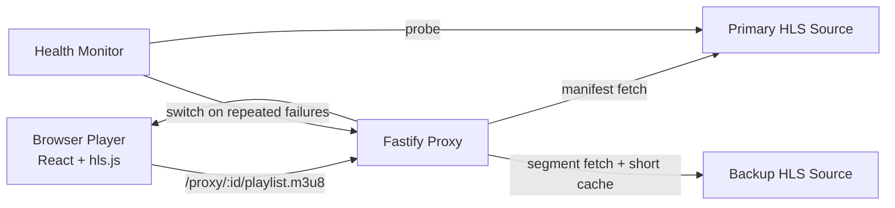

# Live Sports Streaming Platform

Quality-first live-stream aggregator demo focused on low startup time, smooth channel switching, adaptive bitrate behavior, and graceful recovery when an upstream source degrades.

## What This Project Delivers

- Browser app that plays multiple live or live-style channels from one page.
- Channel metadata includes the current event and next event, which are derived from a schedule feed rather than hardcoded in the UI.
- At least two sports categories are present and switchable from the same UI:
	- Football
	- Basketball (m issing scheduling)
    - Motor sports & F1
    - Multti sports
- Stream delivery runs through a Fastify HLS proxy with manifest rewriting, segment caching, and health monitoring with failover.
- Player is tuned for live playback with hls.js metrics and recovery handling.

## Notes

- Architecture: React + Vite on the client, Fastify on the server, HLS proxying for manifests and segments, in-memory segment caching, and background health checks that can fail over to backup feeds.
- Trade-offs: Currently prioritized simple deployment, fast channel switching, and playback resilience over owning ingest/transcoding, persistent storage, or sub-second latency.
- Costs used: `$0` paid infrastructure or API spend for this demo; it relies on local runtime plus public/live-style upstream HLS sources.
- Timezones: schedule timestamps are stored in UTC and rendered in the viewer’s selected timezone, defaulting to the browser locale with a manual override in the header.
- Next steps: add live program metadata or EPG data, persist health history, move cache to a shared layer/CDN, and tighten observability around latency, startup, and failover events.

## Quick Start

### 1. Install dependencies

```bash
cd client && npm install
cd ../server && npm install
```

### 2. Optional source overrides

The app ships with runnable defaults. Set environment variables for the channels you want to override. The code supports primary/backup overrides per channel category.

The current defaults are:

- Football: a live sports feed with a backup sports feed.
- Basketball: a live NBA-oriented feed with alternate sports backups.
- F1: a dedicated F1 section with a Formula fallback.

Additional basketball-friendly alternates are already wired in the codebase so you can swap them in without changing the UI or player logic.

### 2b. Metadata model

Each channel now carries:

- `matchContext` for a short live description.
- `currentEvent` for the active show/game block.
- `nextEvent` for the upcoming block.
- A `scheduleSourceUrl` that points to a JSON feed of events for that channel.

The server fetches that feed on every `/channels` request, derives the current and next event from the latest data, and the client polls `/channels` periodically so the UI stays fresh without hardcoded schedule windows.

The header includes a timezone selector so you can switch between local browser time, UTC, and a few common zones without changing the underlying schedule data.

### 3. Run locally

Terminal A:

```bash
cd server
npm run dev
```

Terminal B:

```bash
cd client
npm run dev
```

Open the Vite URL (typically `http://localhost:5173`).

### 4. Run with Docker Compose

From the repository root:

```bash
docker compose up --build
```

Then open:

- Client: `http://localhost:5174`
- Server health: `http://localhost:4001/health`

To stop:

```bash
docker compose down
```

## Demo Script (3 Minutes)

1. Open app and start Football channel. Show startup metric and bitrate/resolution changing.
2. Switch to Basketball channel. Call out switch speed and stable playback.
3. Click `Simulate source failure` to force failover.
4. Show backup indicator in header/sidebar and continued playback.
5. Open `http://localhost:4000/health` and show `usingBackup`, `failures`, and latency state.

## Architecture



### Core components

- `server/src/proxy/rewriteManifest.ts`
	- Rewrites nested playlist and segment URLs so all media flows through proxy routes.
- `server/src/proxy/handlers.ts`
	- Adds upstream timeout handling, status checks, and cache headers.
- `server/src/health/store.ts` + `server/src/health/monitor.ts`
	- Tracks channel health, failover to backup after repeated failures, and controlled failback.
- `client/src/components/Player/index.tsx`
	- Creates a fresh hls.js instance on channel changes to avoid stale state and improve switch reliability.
- `client/src/components/Player/hlsEventHandlers.ts`
	- Handles startup measurement, retry/backoff, and rebuffer counting.
- `client/src/components/Player/PlayerStatsGrid.tsx`
	- Shows startup, bitrate, resolution, level, buffer, latency, dropped frames, and rebuffers.

## Stream Quality Decisions

- Low-latency leaning hls.js settings (`lowLatencyMode`, tighter live sync window, bounded buffers).
- Recovery-first strategy:
	- exponential retry for transient network errors,
	- media-error recovery,
	- clear error state transitions.
- Fast channel switching:
	- explicit teardown/recreate of player pipeline per channel to avoid cross-channel residue.
- Server-side resilience:
	- periodic health probes,
	- automatic backup failover,
	- conservative primary failback only after consecutive successful checks.

## Why This Stack

### Protocol choice

HLS is the right trade-off for this project in my opinion because it is broadly supported in desktop browsers, simple to proxy, and stable under time pressure. LL-HLS would reduce latency further, but it adds origin and packaging complexity that is easy to get wrong in a short build. DASH is viable too, but native desktop browser support is less universal and the player stack would need much more tuning. WebRTC would deliver the lowest latency, but it is a higher complexity option and is not the best fit for a multi-channel aggregator where scale and reliability matter more than sub-second glass-to-glass delay.

### Ingest and transcoding

I intentionally avoided building a full ingest/transcode pipeline for this pass. ffmpeg plus a media server such as MediaMTX, nginx-rtmp, or OvenMediaEngine would be the next step if we owned the live sources ourselves and needed adaptive ladders from a custom feed. For this demo, external live HLS sources already provide the packaging and ABR ladder, so the fastest path to a working result is to focus on proxying, switching, and recovery.

### Delivery

The server proxies manifests and segments, rewrites URLs so the browser only talks to one origin, and caches segments briefly to reduce upstream churn. That keeps playback simple on the client side and creates a natural point to add CDN or shared cache later. At larger scale, I would move segment caching to a distributed cache or edge/CDN layer and keep the proxy stateless.

### Player

I chose hls.js because it gives explicit control over low-latency settings, ABR behavior, recovery hooks, and stream telemetry. The player tuning keeps buffers bounded, retries transient network issues, attempts media recovery, and recreates the HLS instance on channel switches to avoid stale state. That matters more here than a richer UI wrapper.

### Resilience

If a source drops or stalls, the server health monitor marks failures, failover moves the channel to a backup source, and the player keeps retrying before surfacing a clear error. If the source changes resolution or the ABR ladder shifts, the player continues tracking the active level and current playback metrics rather than resetting the experience. The design goal is to degrade gracefully, recover automatically, and keep the viewer in playback instead of forcing manual refreshes.

## Trade-offs Made Under Time Pressure

- Prioritized playback smoothness and recovery over broad product features.
- Chose HLS proxy + hls.js over adding ingest/transcoding stack to keep delivery fast and stable.
- Used runnable live-style defaults and env-driven source swapping to reduce demo risk from volatile public feeds.
- Kept storage/cache in-memory for simplicity; production would move to shared cache/CDN.

## Costs

- External API/service spend: `$0` for this version.

## Validation Checklist

- Client build:

```bash
cd client && npm run build
```

- Server build:

```bash
cd server && npm run build
```

- Endpoint smoke tests:

```bash
curl http://localhost:4000/channels
curl http://localhost:4000/health
curl http://localhost:4000/proxy/<channel-id>/playlist.m3u8 | head
```

## What I Would Do Next With More Time

- Add multi-variant source preflight and automatic source scoring before channel publish.
- Implement optional LL-HLS path and latency budget telemetry (edge delay, join latency histograms).
- Add manual quality selector with `Auto`/fixed level override.
- Add per-channel alerting + persistent health history.
- Add CDN layer and distributed cache for large concurrent viewer scale.