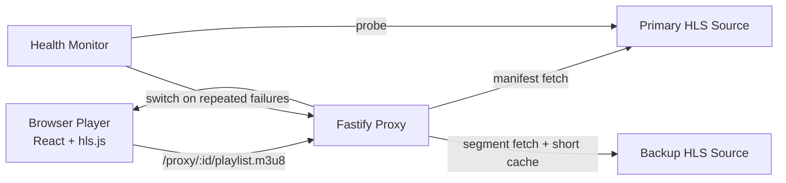

# Live Sports Streaming Platform

Quality-first live-stream aggregator demo focused on low startup time, smooth channel switching, adaptive bitrate behavior, and graceful recovery when an upstream source degrades.

## What This Project Delivers

- Browser app that plays multiple live or live-style channels from one page.
- At least two sports categories are present and switchable from the same UI:
	- Soccer
	- Basketball
- Stream delivery runs through a Fastify HLS proxy with manifest rewriting, segment caching, and health monitoring with failover.
- Player is tuned for live playback with hls.js metrics and recovery handling.

## Quick Start

### 1. Install dependencies

```bash
cd client && npm install
cd ../server && npm install
```

### 2. (Optional but recommended) set real sports feeds

Defaults are runnable live-style HLS sources. For review-day realism, set real sports HLS sources via env vars:

```bash
export SOCCER_PRIMARY="https://your-live-soccer-source/master.m3u8"
export SOCCER_BACKUP="https://your-fallback-source/master.m3u8"
export BASKETBALL_PRIMARY="https://your-live-basketball-source/master.m3u8"
export BASKETBALL_BACKUP="https://your-fallback-source/master.m3u8"
```

Also supported:

- `MUX_TEST_PRIMARY`, `MUX_TEST_BACKUP`
- `APPLE_BIPBOP_PRIMARY`, `APPLE_BIPBOP_BACKUP`

### 3. Run locally

Terminal A:

```bash
cd server
npm run dev
```

Terminal B:

```bash
cd client
npm run dev
```

Open the Vite URL (typically `http://localhost:5173`).

## Demo Script (3 Minutes)

1. Open app and start Soccer channel. Show startup metric and bitrate/resolution changing.
2. Switch to Basketball channel. Call out switch speed and stable playback.
3. Click `Simulate source failure` to force failover.
4. Show backup indicator in header/sidebar and continued playback.
5. Open `http://localhost:4000/health` and show `usingBackup`, `failures`, and latency state.

## Architecture



### Core components

- `server/src/proxy/rewriteManifest.ts`
	- Rewrites nested playlist and segment URLs so all media flows through proxy routes.
- `server/src/proxy/handlers.ts`
	- Adds upstream timeout handling, status checks, and cache headers.
- `server/src/health/store.ts` + `server/src/health/monitor.ts`
	- Tracks channel health, failover to backup after repeated failures, and controlled failback.
- `client/src/components/Player/index.tsx`
	- Creates a fresh hls.js instance on channel changes to avoid stale state and improve switch reliability.
- `client/src/components/Player/hlsEventHandlers.ts`
	- Handles startup measurement, retry/backoff, and rebuffer counting.
- `client/src/components/Player/PlayerStatsGrid.tsx`
	- Shows startup, bitrate, resolution, level, buffer, latency, dropped frames, and rebuffers.

## Stream Quality Decisions

- Low-latency leaning hls.js settings (`lowLatencyMode`, tighter live sync window, bounded buffers).
- Recovery-first strategy:
	- exponential retry for transient network errors,
	- media-error recovery,
	- clear error state transitions.
- Fast channel switching:
	- explicit teardown/recreate of player pipeline per channel to avoid cross-channel residue.
- Server-side resilience:
	- periodic health probes,
	- automatic backup failover,
	- conservative primary failback only after consecutive successful checks.

## Trade-offs Made Under Time Pressure

- Prioritized playback smoothness and recovery over broad product features.
- Chose HLS proxy + hls.js over adding ingest/transcoding stack to keep delivery fast and stable.
- Used runnable live-style defaults and env-driven source swapping to reduce demo risk from volatile public feeds.
- Kept storage/cache in-memory for simplicity; production would move to shared cache/CDN.

## Costs

- External API/service spend: `$0` for this version.

## Validation Checklist

- Client build:

```bash
cd client && npm run build
```

- Server build:

```bash
cd server && npm run build
```

- Endpoint smoke tests:

```bash
curl http://localhost:4000/channels
curl http://localhost:4000/health
curl http://localhost:4000/proxy/soccer-fast/playlist.m3u8 | head
```

## What I Would Do Next With More Time

- Add multi-variant source preflight and automatic source scoring before channel publish.
- Implement optional LL-HLS path and latency budget telemetry (edge delay, join latency histograms).
- Add manual quality selector with `Auto`/fixed level override.
- Add per-channel alerting + persistent health history.
- Add CDN layer and distributed cache for large concurrent viewer scale.