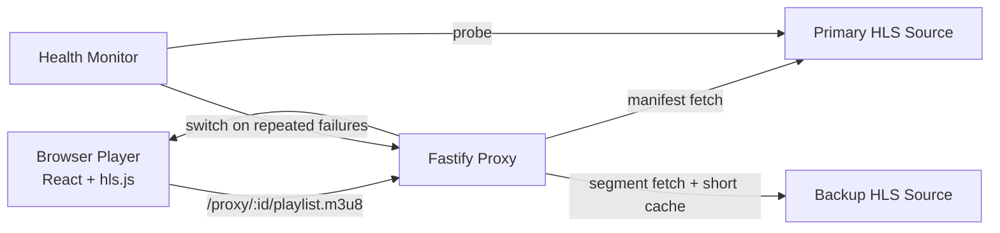

# Live Sports Streaming Platform

Quality-first live-stream aggregator demo focused on low startup time, smooth channel switching, adaptive bitrate behavior, and graceful recovery when an upstream source degrades.

## Overview

This project provides a browser-based live sports experience powered by a React client and a Fastify server-side HLS proxy.

### What it delivers

- Multi-channel playback from a single UI.
- Sports category switching (Football, Basketball, Motorsports/F1, and multi-sport feeds).
- Dynamic event metadata (`currentEvent` and `nextEvent`) derived from schedule feeds.
- Proxy-based stream delivery with manifest rewriting, segment caching, and source failover.
- Live playback metrics and recovery handling via hls.js.

### Key notes

- Architecture: React + Vite client, Fastify server, HLS manifest/segment proxy, in-memory segment caching, and background health checks.
- Timezone handling: schedule timestamps are stored in UTC and rendered in the viewer-selected timezone.
- Cost for this demo: `$0` paid infrastructure/API spend.

## Architecture



### Core components

- `server/src/proxy/rewriteManifest.ts`: rewrites nested playlist and segment URLs so all media flows through proxy routes.
- `server/src/proxy/handlers.ts`: adds upstream timeout handling, status checks, and cache headers.
- `server/src/health/store.ts` + `server/src/health/monitor.ts`: tracks channel health, failover, and controlled failback.
- `client/src/components/Player/index.tsx`: recreates hls.js on channel changes for reliable switching.
- `client/src/components/Player/hlsEventHandlers.ts`: startup timing, retry/backoff, and rebuffer counting.
- `client/src/components/Player/PlayerStatsGrid.tsx`: startup, bitrate, resolution, level, buffer, latency, dropped frames, and rebuffer metrics.

## Quick Start

### 1. Install dependencies

```bash
cd client && npm install
cd ../server && npm install
```

### 2. Run locally (recommended for development)

Terminal A:

```bash
cd server
npm run dev
```

Terminal B:

```bash
cd client
npm run dev
```

Then open `http://localhost:5173`.

Local API endpoints:

- Channels: `http://localhost:4000/channels`
- Health: `http://localhost:4000/health`

### 3. Run with Docker Compose

From the repository root:

```bash
docker compose up --build
```

Then open:

- Client: `http://localhost:5173`
- Server health: `http://localhost:4001/health`

To stop:

```bash
docker compose down
```

## Configuration

### Source overrides (optional)

The app ships with runnable defaults. You can override channel source URLs with environment variables. The server supports primary/backup sources per channel category.

Default intent:

- Football: live sports feed + backup sports feed.
- Basketball: NBA-oriented feed + alternate sports backups.
- F1: dedicated Formula feed + fallback.

Additional alternates are already wired in the codebase, so you can swap sources without changing UI/player logic.

### Channel metadata model

Each channel carries:

- `matchContext`: short live description.
- `currentEvent`: active game/show block.
- `nextEvent`: upcoming block.
- `scheduleSourceUrl`: JSON schedule feed URL.

On each `/channels` request, the server refreshes schedule data and derives `currentEvent`/`nextEvent`. The client polls `/channels` to keep metadata fresh without hardcoded windows.

### Timezone behavior

The header includes a timezone selector (local browser time, UTC, and common zones). Stored schedule data remains UTC; only rendering changes.

## Demo Script (3 minutes)

1. Start on Football and show startup metric plus bitrate/resolution changes.
2. Switch to Basketball and call out switch speed and playback stability.
3. Trigger `Simulate source failure`.
4. Show backup indicator in header/sidebar and continued playback.
5. Open health endpoint and show `usingBackup`, `failures`, and latency state.

Use:

- Local run: `http://localhost:4000/health`
- Docker run: `http://localhost:4001/health`

## Stream Quality and Resilience Decisions

- Low-latency-leaning hls.js settings (`lowLatencyMode`, tighter live sync window, bounded buffers).
- Recovery-first strategy with exponential retry, media-error recovery, and explicit error-state transitions.
- Fast channel switching via full player teardown/recreate per channel.
- Server-side failover with periodic probes, automatic backup switch, and conservative primary failback.

## Why This Stack

### Protocol choice

HLS is the practical trade-off for broad browser support, straightforward proxying, and reliable behavior under time pressure. LL-HLS can reduce latency further but adds origin/packaging complexity. DASH is viable but less universally supported in desktop browsers. WebRTC offers lower latency but significantly higher operational complexity for this aggregator use case.

### Ingest/transcoding scope

This version intentionally avoids a full ingest/transcode pipeline. External HLS sources already provide packaging and ABR ladders, allowing focus on switching and resilience.

### Delivery strategy

The proxy rewrites stream URLs and briefly caches segments. This simplifies the browser path and creates a clean migration path to CDN/distributed caching later.

### Player strategy

hls.js provides direct control of ABR, low-latency tuning, retries, and telemetry, which are critical for smooth live playback and robust channel switching.

## Trade-offs

- Prioritized playback smoothness and recovery over wider product features.
- Chose HLS proxy + hls.js over ingest/transcoding complexity.
- Used env-driven source swapping to reduce risk from volatile public feeds.
- Kept caching/state in-memory for simplicity; production would use shared cache/CDN.

## Validation Checklist

Client build:

```bash
cd client && npm run build
```

Server build:

```bash
cd server && npm run build
```

Endpoint smoke tests (local server):

```bash
curl http://localhost:4000/channels
curl http://localhost:4000/health
curl http://localhost:4000/proxy/<channel-id>/playlist.m3u8 | head
```

## Possible Future Enhancements

These are realistic improvements based on the current implementation.

- [ ] Improve schedule resilience: add request timeout/retry/circuit-breaker behavior for schedule sources and cache the last-known-good schedule so `/channels` remains stable during upstream outages.
- [ ] Add configuration validation: validate channel IDs and environment-variable overrides at startup (and fail fast on invalid values) to prevent silent config drift.
- [ ] Harden debug controls: gate `/debug/break/:id` behind an environment flag or auth guard so failure simulation is not exposed in non-dev environments.
- [ ] Expand observability: add structured logs, request IDs, and metrics export (startup time, rebuffers, failovers, segment/cache hit rate, upstream error rate).
- [ ] Persist health history: store health/failover timelines in Redis/Postgres for trend analysis and alerting instead of in-memory only state.
- [ ] Upgrade caching architecture: move segment caching from process memory to shared cache/CDN for horizontal scaling and consistent cache hit rates.
- [ ] Add source preflight and scoring: evaluate all candidate manifests before publish and auto-rank by availability, startup speed, and stability.
- [ ] Add playback controls: provide a user-facing quality selector (`Auto` + fixed levels), optional latency mode toggle, and DVR/live-edge controls.
- [ ] Broaden timezone and calendar support: add more timezone presets and optional locale-aware date formatting for schedule rendering.
- [ ] Add test coverage and CI: include unit tests for schedule normalization and manifest rewriting, plus integration tests for proxy failover paths.